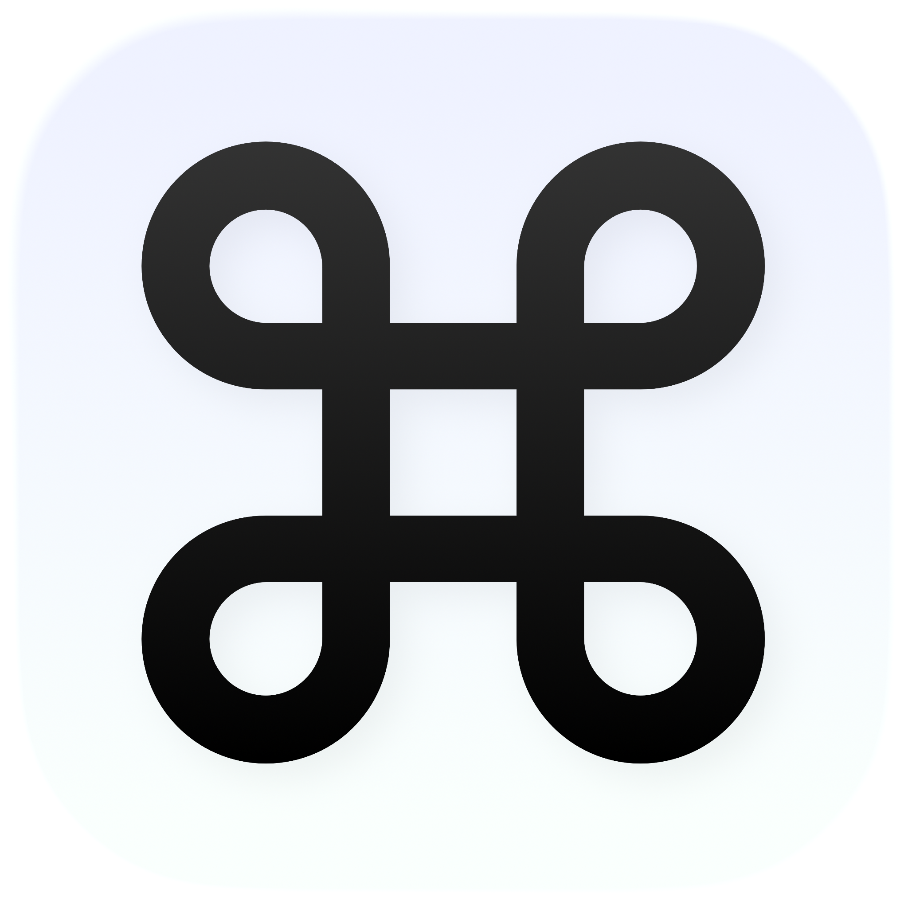

<p align="center">
  
</p>

<h1 align="center">cmdtab</h1>

<p align="center">Cmd+Tab replacement for macOS with app groups — switch within context, not across everything.</p>

<p align="center">
  <a href="https://github.com/verkhozin/cmdtab/raw/main/docs/cmdtabDemo.mp4">
    
  </a>
</p>

Organise your apps into groups like "Dev", "Comms", "Personal" and switch only within the active group. One hotkey, zero noise.

macOS gives you one flat Cmd+Tab strip with every running app. cmdtab gives you focused groups.

## How it works

Hit **Option+Tab**, and a Liquid Glass overlay appears showing only the apps in your active group. Arrow through them (or keep tapping Tab), release to activate. Switch groups with the group bar at the top. The system Cmd+Tab keeps working alongside — cmdtab doesn't replace it, it runs in parallel.

## Use cases

- **Deep work** — group your editor, terminal, browser, and docs viewer into "Dev". Option+Tab only shows those four, no matter how many apps are running.
- **Context switching** — jump from your "Dev" group to "Comms" (Slack, Mail, Zoom) in one group switch, then tab within.
- **Clean separation** — keep personal apps (Spotify, Messages, Telegram) in their own group so they don't clutter your work flow.
- **Presentations** — create a "Demo" group with just the apps you need to show. No accidental tab into Telegram.

## Details

- **Liquid Glass UI** — built on macOS 26's `GlassEffect` for a native, system-integrated look. The selected app highlight morphs within the glass panel, not stacked on top.
- **Non-activating panel** — the switcher overlay doesn't steal focus from your current text input. Type, trigger the switcher, pick an app, keep typing.
- **Global hotkey without Accessibility** — uses Carbon `RegisterEventHotKey`, which requires zero permissions. No Accessibility prompt on first launch.
- **Desktop-independent** — the switcher appears over fullscreen apps and on any Space.
- **JSON-backed groups** — groups are stored as plain JSON in `~/Library/Application Support/cmdtab/groups.json`. Power users can edit them by hand.
- **Menu bar only** — no Dock icon. A status item gives access to settings and quit.

## Architecture

Swift across `App / Core / Models / RunningApps / Switcher / Settings / MenuBar`. The app is `LSUIElement` — menu bar only. The switcher is a borderless `NSPanel` with `.nonactivatingPanel` + `.floating` hosting a SwiftUI view via `NSHostingView`. Global hotkey is Carbon `RegisterEventHotKey`. App activation uses `NSRunningApplication.activate()`. Strict concurrency is on.

## Requirements

- macOS 26+ (Liquid Glass)
- Xcode 16+
- Accessibility permission only needed for per-window switching (post-MVP)

## Build & run

```bash
brew install xcodegen          # one time
xcodegen generate              # regenerates cmdtab.xcodeproj from project.yml
open cmdtab.xcodeproj          # then Cmd+R in Xcode
```

## Shortcuts

| Shortcut | Action |
|----------|--------|
| Option+Tab | Open the switcher / cycle to next app |
| Arrow keys | Navigate within the switcher |
| Return | Activate the selected app |
| Esc | Dismiss the switcher |

## License

MIT
